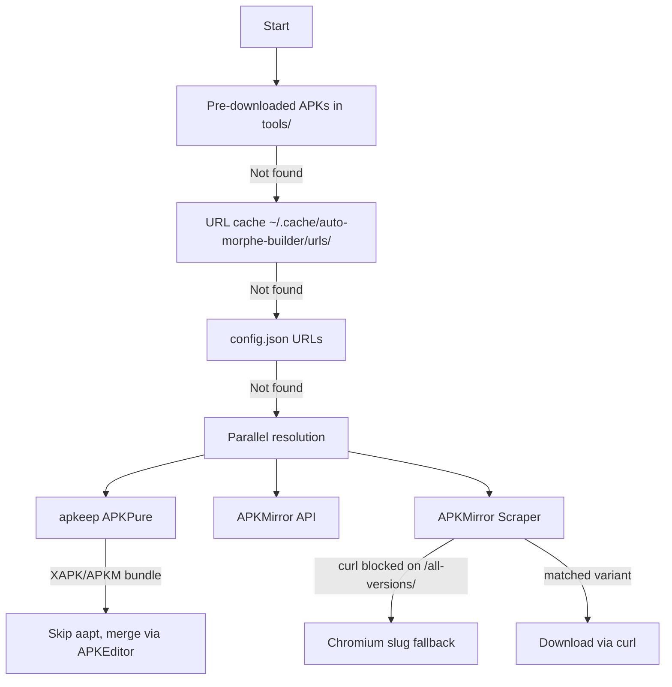

# AutoMorpheBuilder

**Automated GitHub Actions pipeline** for building patched Android APKs using [Morphe patches](https://github.com/MorpheApp/morphe-patches), [morphe-desktop](https://github.com/MorpheApp/morphe-desktop), and [APKEditor](https://github.com/REAndroid/APKEditor).

🌟 **Forking this repo and patching apps for personal use is encouraged!** Feel free to customize the workflow, add more apps, or modify patches to suit your needs.

---

## 📱 Tested Apps

| App | Package ID |
|-----|------------|
| YouTube | `com.google.android.youtube` |
| YouTube Music | `com.google.android.apps.youtube.music` |
| Reddit | `com.reddit.frontpage` |
| Sofascore | `com.sofascore.results` (community patches via `heval99/morphe-patches`) |

---

## 🔧 What It Does

1. ✅ Checks latest Morphe patch/CLI releases
2. ✅ **Auto-resolves latest supported app versions** from morphe-desktop
3. ✅ Downloads APKs from APKMirror (with fallbacks)
4. ✅ Extracts/selects patchable APK (prefers configured arch, rejects dex-less splits)
5. ✅ Enforces signing (signed or fail)
6. ✅ Runs `morphe-desktop` with your `patches.json` config
7. ✅ Publishes artifacts & creates GitHub Releases

---

## 📄 Setup Guide

Full setup instructions: [→ SETUP.md](SETUP.md)

---

## 📦 Releases & Obtainium

### Release Format
Each app gets its own GitHub Release:
```
<app>-v<base-version>-<patches-version>
```

**Examples:**
- `youtube v20.44.38-v1.24.0-dev.8`
- `ytmusic v8.44.54-v1.24.0-dev.8`
- `reddit v2025.02.17-v1.24.0-dev.8`
- `sofascore v26.07.27-v1.0.0`

### Obtainium Setup
Create **one entry per app** with these settings:

| Setting | Value |
|---------|-------|
| Source | GitHub |
| Repository | `nxn94/AutoMorpheBuilder` |

**Filters per app:**

| App | Release Tag Filter |
|-----|-------------------|
| YouTube | `^youtube` |
| YouTube Music | `^ytmusic` |
| Reddit | `^reddit` |
| Sofascore | `^sofascore` |

---

## 🔐 Required Secrets

Signed builds are **enforced**. Missing required secrets = build fails.

| Secret | Required | Description |
|--------|----------|-------------|
| `KEYSTORE_BASE64` | ✅ Yes | Base64 of your keystore file |
| `KEYSTORE_PASSWORD` | ✅ Yes | Keystore password |
| `KEY_ALIAS` | ❌ No | If empty, uses first alias in keystore |
| `KEY_PASSWORD` | ❌ No | Only if key password ≠ keystore password |
| `APKMIRROR_API_USER` | ❌ No | APKMirror-API username (pair with `_PASS`) |
| `APKMIRROR_API_PASS` | ❌ No | APKMirror-API password |

> 💡 **Tip**: APKMirror-API credentials speed up APK resolution significantly.

---

## ⚙️ Configuration

### `config.json` - Build Settings

```json
{
  "preferred_arch": "arm64-v8a",
  "auto_update_urls": true,
  "patch_repos": {
    "com.google.android.youtube": {
      "name": "youtube",
      "repo": "MorpheApp/morphe-patches",
      "branch": "main",
      "apkmirror_path": "google-inc/youtube"
    }
  },
  "cli": {
    "repo": "MorpheApp/morphe-desktop",
    "branch": "main"
  }
}
```

| Setting | Default | Description |
|---------|---------|-------------|
| `preferred_arch` | `arm64-v8a` | CPU architecture preference |
| `auto_update_urls` | `true` | Auto-update download URLs after builds |
| `patch_repos[*].name` | - | App identifier (e.g., `youtube`) |
| `patch_repos[*].repo` | - | Patch repository |
| `patch_repos[*].branch` | - | Patch branch to use |
| `patch_repos[*].apkmirror_path` | - | APKMirror URL slug |
| `patch_repos[*].pin_version` | - | Optional: lock to specific APK version |
| `cli.repo` | - | morphe-desktop repository |
| `cli.branch` | - | morphe-desktop branch (`main` or `dev`) |

> 📝 **Note**: `download_urls` is auto-managed by the workflow.

### `patches.json` - Patch Toggles

```json
{
  "MorpheApp/morphe-patches": {
    "com.google.android.youtube": {
      "Hide ads": true,
      "SponsorBlock": true,
      "Return YouTube Dislike": false
    }
  }
}
```

- ✅ `true` = enable patch
- ❌ `false` = disable patch
- 🔄 Workflow auto-syncs new upstream patches (default: enabled)
- 💾 Your existing values are **never overwritten**

---

## 📥 APK Download Flow

Multi-source fallback chain (first valid result wins):



**APKMirror Scraper:** Navigates 3 pages (release → variant → download) in same session to preserve cookies. The release-page slug is resolved through `/all-versions/` — when curl hits Cloudflare's HTTP 403 on that page, the scraper falls back to Chromium (whose TLS fingerprint passes bot detection) just for the slug scrape, then continues on curl for the rest of the flow. Sofascore 26.07.27 has the deprecated `soccer-scores-and-sports-livescore-sofascore` URL slug in `apkmirror_path` but the current 2025+ slug is `sofascore-live-sports-scores` — the slug-from-`/all-versions/` resolution captures this drift automatically.

**Split packages (XAPK/APKM/APKS):** Saved by the downloader under the `.apk` extension (filename is hardcoded to `${packageId}_${version}.apk`). The downloader uses content-based shape detection (`detectApkShape`) to skip the aapt version check on zip-of-zips and let the post-merge step (`download-supported-apk.js`) verify the inner `base.apk` instead. The same detector powers the post-merge split-package detection, so APKMirror bundles saved with `.apk` filenames still get merged correctly. Sofascore's arm64-v8a variant from APKPure is a XAPK bundle — this path lets the 57MB arm64-v8a variant win instead of the 93MB universal.

---

## 🎯 APK Selection Logic

- ✅ Resolves Morphe-supported versions, downloads latest supported
- ✅ Handles: `.apk`, `.xapk`, `.apkm`, `.apks` (split packages detected by **content** — extension-agnostic — so APKMirror bundles saved with `.apk` filenames still get merged)
- ✅ For splits: tries APKEditor merge → falls back to dex-bearing APK extraction
- ✅ Architecture: prefers `preferred_arch` from config
- ✅ DPI preference (APKMirror only — apkeep takes whatever APKPure serves): `nodpi` → `120-640dpi` → `480-640dpi` → `120-480dpi` → `240-480dpi`
- ❌ Rejects dex-less APKs (requires `classes*.dex`)

---

## 🔏 Signing Flow

1. Decodes `KEYSTORE_BASE64` → `tools/source.keystore`
2. Detects keystore type (`PKCS12`, `JKS`, `BKS`, `UBER`)
3. Converts to BKS for Morphe compatibility
4. Validates alias and signs patched APK
5. **Fails immediately if signing fails**

---

## ⏰ Build Triggers

| Trigger | Schedule |
|---------|----------|
| Manual | `workflow_dispatch` |
| Scheduled | Daily at `05:15 UTC` |

---

## 📦 Outputs

| Output | Format |
|--------|--------|
| Per-app artifacts | `<app>-v<base>-<patches>.apk` |
| Per-app releases | `<app>-v<base>-<patches>` (contains only that APK) |

---

## 🚨 Troubleshooting

### ❌ APK download fails
- Check `apkmirror_path` values in `config.json`
- Retry workflow (transient Cloudflare blocks are common)
- APKMirror-API credentials help avoid Playwright fallback
- Looking at `check-versions` → `Pre-download APKs (parallel)` logs: `[pkg] could not determine version` means `morphe-desktop list-versions` returned no matching version for the per-app `.mpp` — verify the patch repo at `patch_repos[*].repo` actually has your app

### ❌ Download succeeds but build fails on `Chosen APK has no classes.dex`
- The selected file is a split config APK, not the base APK
- Check APKMirror manually to confirm an APK variant exists
- For apps that ship only BUNDLE variants (Reddit, YouTube, etc.), the workflow depends on APKEditor for the merge — the post-merge version check in `download-supported-apk.js` re-validates the inner `base.apk`'s versionName

### ❌ Sofascore (or arm64-v8a-only) downloads ship `armeabi-v7a`-only libs
- The arm64-v8a variant from APKPure for Sofascore is a 57MB XAPK bundle (containing `config.arm64_v8a.apk`); the 93MB universal variant is the wrong-arch fallback. The downloader picks the arm64-v8a variant by size when both exist. If you see `arm64-v8a/libs missing` from APKMirror or apkmirror-api, the upstream bundle is mislabeled — try `pin_version` to lock to a known-good version

### ❌ `Wrong version of key store`
Verify:
1. `KEYSTORE_BASE64` decodes to your actual keystore
2. `KEYSTORE_PASSWORD` is correct
3. `KEY_PASSWORD` is set if key password differs

### ❌ Obtainium not finding updates
- Use correct Release Tag Filter regex (see [Obtainium Setup](#obtainium-setup))

---

## 🙏 Thanks

- [Morphe patches](https://github.com/MorpheApp/morphe-patches) - patch definitions & compatibility
- [morphe-desktop](https://github.com/MorpheApp/morphe-desktop) - patching & signing
- [APKEditor](https://github.com/REAndroid/APKEditor) - split package merge
- [Bouncy Castle](https://www.bouncycastle.org/) - keystore compatibility

---

## 📜 License

Apache License 2.0 - See [LICENSE](LICENSE)
