# Architecture

AutoMorpheBuilder is a **GitHub Actions pipeline** that produces signed, patched Android APKs and publishes them as per-app GitHub Releases. There is no application code to run locally — the workflow files, shell pipeline, and Node.js helpers under `.github/scripts/` **are** the product.

## High-level flow

1. **`check-versions`** resolves the latest Morphe patches tags per app and the latest `morphe-desktop` CLI tag, then filters the build matrix by whether each app's expected release already exists.
2. **`build`** (matrix per app) downloads the APK, applies patches, signs the result.
3. **`create-release`** publishes one GitHub Release per app and prunes the oldest beyond `KEEP_COUNT`.

```mermaid
flowchart TD
    A[schedule: daily 05:15 UTC<br/>or workflow_dispatch] --> B[check-versions job]

    B --> B1[Resolve latest tags<br/>check_versions.sh]
    B1 --> B2[Set up Java 21]
    B2 --> B3[Preflight per-app patch availability<br/>preflight-apps.js]
    B3 --> B4[Download morphe-desktop + per-repo .mpp<br/>download_morphe_tools.sh]
    B4 --> B5[Cache patches .mpp<br/>morphe-desktop.jar is intentionally NOT cached]
    B5 --> B6[Compat probe per app<br/>compat-probe.js runs list-versions, classifies stderr<br/>for NoSuchMethodError / NoClassDefFoundError / VerifyError]
    B6 --> B7[Filter matrix by existing releases<br/>check_existing_releases.sh]
    B7 --> B8{should-build?}
    B8 -->|false| Z1[build + create-release skipped<br/>no-op day]
    B8 -->|true| B9[Setup Node 24 + npm ci]
    B9 --> B10[Cache + install Playwright Chromium]
    B10 --> B11[Cache + install apkeep]
    B11 --> B12[Install aapt]
    B12 --> B13[Pre-download APKs in parallel<br/>pre_download_apks.sh]
    B13 --> C[build job matrix per app]

    C --> C1[Checkout + Java 21]
    C1 --> C2[Restore BouncyCastle / apkeep / Playwright<br/>from check-versions artifacts]
    C2 --> C3[Restore pre-downloaded APKs]
    C3 --> C4[Cache + fetch morphe tools<br/>fetch_morphe_tools.sh<br/>morphe-desktop.jar always re-downloaded]
    C4 --> C5[Resolve supported version<br/>prepare_target_version.sh]
    C5 --> C6[Download supported APK<br/>download-supported-apk.js<br/>multi-source fallback chain]
    C6 --> C7[Prepare signing keystore<br/>prepare_keystore.sh<br/>signing is enforced]
    C7 --> C8[Patch APK<br/>patch_apk.sh runs morphe-desktop patch]
    C8 --> C9[Upload patched APK as artifact]

    C9 --> D[create-release job]

    D --> D1[Download all patched APKs]
    D1 --> D2[Publish per-app releases<br/>create_release.sh<br/>tag = name-v apk -v patches]
    D2 --> D3[Prune old releases per app<br/>prune_old_releases.sh<br/>keep KEEP_COUNT = 2 by default]

    style B5 stroke-dasharray: 4 4
    style B6 stroke-dasharray: 4 4
    style C4 stroke-dasharray: 4 4
```



## Jobs in detail

### `check-versions`

Runs first. Failures here short-circuit the rest of the workflow.

| Step | Script | Purpose |
|------|--------|---------|
| Resolve latest Morphe + CLI versions | `pipeline/check_versions.sh` | Emits the optimistic default (`should-build=true`, full matrix) — the downstream filter overrides it. |
| Set up Java 21 | `actions/setup-java@v5` | Required for `java -jar morphe-desktop.jar`. Default runner Java is older and fails to invoke the jar. |
| Preflight per-app patch availability | `scripts/preflight-apps.js` | Hits each patch repo's `patches-list.json` at the resolved tag and confirms the app's package id is in `compatiblePackages`. Fail-fast per-app table on upstream rename or typo'd package id. |
| Download morphe-desktop + patches `.mpp` | `pipeline/download_morphe_tools.sh` | Provides the jar + per-repo `.mpp` files the filter step needs. Runs **unconditionally** so the filter step runs before the expensive Playwright / apkeep / aapt installs. |
| Cache patches `.mpp` | `actions/cache@v5` | Caches only the per-repo `.mpp` files. **The CLI jar is intentionally NOT cached** — see "Notes" below. |
| Compat probe | `scripts/compat-probe.js` | Actually invokes `morphe-desktop list-versions` per app to catch runtime API mismatches the static preflight can't see (e.g. hoo-dles/morphe-patches using `BytecodePatchBuilder.extendWithAll(Supplier)` added to morphe-patcher 2026-07-27, which only morphe-desktop v1.13.2+ carries). |
| Filter matrix by existing releases | `pipeline/check_existing_releases.sh` | For each app, resolves the APK version (pinned or via `morphe-desktop list-versions`) and drops entries whose `<name>-v<apk>-<patches>` release already exists. **Fail-open**: if version resolution or `gh release view` errors, the app is kept in the matrix. `FORCE_BUILD=1` on `workflow_dispatch` skips the check. |
| Setup Node 24 + `npm ci` | `actions/setup-node@v6` + `npm ci` | Gated on `should-build == 'true'`. |
| Cache + install Playwright | `actions/cache@v5` + `pipeline/install_playwright.sh` | The custom installer bypasses a yauzl extraction bug in Playwright 1.58. |
| Install apkeep + aapt | `pipeline/install_apkeep.sh` + `pipeline/install_aapt.sh` | apkeep is pinned to SHA-256 against `APKEEP_VERSION`. |
| Pre-download APKs in parallel | `pipeline/pre_download_apks.sh` | Per-app `&` + `wait`. Honours `SKIP_LIST` from the filter step. Calls `update-download-urls.js` per app (writes back only when `auto_update_urls=true` and no `pin_version` is set). |

**Notes:**

- The CLI jar is **never** cached. `download_morphe_tools.sh` always `rm -f` and re-downloads it, because `actions/cache@v5` only saves on a cache miss — a restore would silently put a stale jar back into `tools/`. Both download scripts verify the jar's `Implementation-Version` from `META-INF/MANIFEST.MF` matches `CLI_VERSION` after download.
- The compat probe classifies stderr for `NoSuchMethodError`, `NoClassDefFoundError`, `IncompatibleClassChangeError`, `VerifyError`, `LinkageError` and emits an actionable `::error::` ("bump cli or pin each affected app to an older patch tag") instead of waiting 30 minutes for the matrix to surface the same crash.

### `build`

Per-app matrix. Already filtered to apps that need rebuilding by `check-versions`. `fail-fast: false` so a single app failure does not cancel the others.

| Step | Purpose |
|------|---------|
| Checkout + Java 21 | Standard runner setup. |
| Restore BouncyCastle / apkeep / Playwright / pre-downloaded APKs | `actions/download-artifact@v8` from `check-versions` artifacts. |
| Cache + fetch morphe tools | `fetch_morphe_tools.sh` re-downloads `morphe-desktop.jar` fresh, then per-app `.mpp` and `APKEditor.jar`. The `.mpp` is restored from cache with `restore-keys` fallback. |
| Resolve supported version | `prepare_target_version.sh` + inline `list-versions` invocation. Pinned apps skip the CLI call. The `sort -Vr` head-pick handles `list-versions` not guaranteeing "latest first" (Twitch's RookieEnough/De-Vanced prints `16.9.1` before `25.3.0`). |
| Cache APK | `actions/cache@v5` keyed on `apk-<name>-<version>`. |
| Install aapt | For post-download version validation. |
| Download supported APK | `download-supported-apk.js`. Multi-source fallback: `tools/*.apk` → URL cache (`~/.cache/auto-morphe-builder/urls/`) → `config.json download_urls` → parallel resolution via apkeep (APKPure), APKMirror-API (if creds), APKMirror scraper (curl → Chromium fallback). **Cleanup on failure** removes partial APK on ABI / version validation throw so a stale file does not pre-empt the good one. |
| Prepare signing keystore | `prepare_keystore.sh` decodes `KEYSTORE_BASE64`, detects type (PKCS12 / JKS / BKS / UBER), produces BKS (morphe-desktop) + PKCS12 (apksigner) keystores. Uses `keytool -storepass:env / -keypass:env` so passwords never appear on the cmdline. **Hard-fails on any signing error** — there is no unsigned output path. |
| Patch APK | `patch_apk.sh` runs `morphe-desktop.jar patch`. |
| Upload patched APK | `${{ matrix.name }}-v${{ version }}-${{ patches-tag }}` artifact. |

### `create-release`

Runs after `build` succeeds.

| Step | Purpose |
|------|---------|
| Download all patched APKs | `actions/download-artifact@v8` with `pattern: "*-v*"` + `merge-multiple: true`. |
| Publish per-app releases | `create_release.sh` creates one GitHub Release per app, tag `<name>-v<base-version>-<patches-version>`, contains only that app's APK. |
| Prune old releases | `prune_old_releases.sh` caps each app's release history at `KEEP_COUNT` (default `2`) by `gh release delete --cleanup-tag` on the oldest beyond the window. Failures on a single tag (race / already gone) are warnings only. |

## Source layout

```
.github/
├── workflows/             YAML entrypoints (morphe-build, ci, codeql, update-patches)
├── scripts/
│   ├── *.js               Top-level Node.js helpers (downloaders, validators, install scripts)
│   ├── __tests__/         Jest tests for the helpers above
│   └── pipeline/
│       ├── *.sh           One shell script per workflow step
│       └── lib/           Sourced helpers shared across *.sh
├── ISSUE_TEMPLATE/        Issue templates + config.yml
├── pull_request_template.md
└── CODEOWNERS             Required reviewers per path

config.json                Build config (this repo's "settings")
patches.json               Patch toggles (repo-keyed: { "owner/repo": { "pkg": { "Patch": true } } })
patches-list.json          Per-repo, per-tag cache of compatiblePackages from the patches .mpp (managed)
LICENSE                    GPL-3.0
SECURITY.md                Vulnerability disclosure policy
CONTRIBUTING.md            How to file issues, send PRs, validate locally
docs/                      This documentation
```

## Signing model

Signing is enforced end-to-end. There is no `--unsigned` path and no env-gated skip.

1. **Decode.** `KEYSTORE_BASE64` → `tools/source.keystore`.
2. **Detect type.** `keytool -list` and sniff the magic bytes to identify PKCS12 / JKS / BKS / UBER.
3. **Convert.** morphe-desktop requires BKS; apksigner prefers PKCS12. The script writes both, derived from the source.
4. **Patch.** morphe-desktop signs in the same step that applies the `.mpp` patches.
5. **Validate.** `apksigner verify` is run after the patch step. Failure aborts the build.

Required secrets: `KEYSTORE_BASE64`, `KEYSTORE_PASSWORD`. Optional: `KEY_ALIAS` (defaults to first alias), `KEY_PASSWORD` (only if the key password differs from the keystore password).

## Failure model

The workflow is **fail-open** on version resolution (per app) and **fail-closed** on signing and on patch availability. See `docs/troubleshooting.md` for the catalogue of common failure modes and their remediation.
